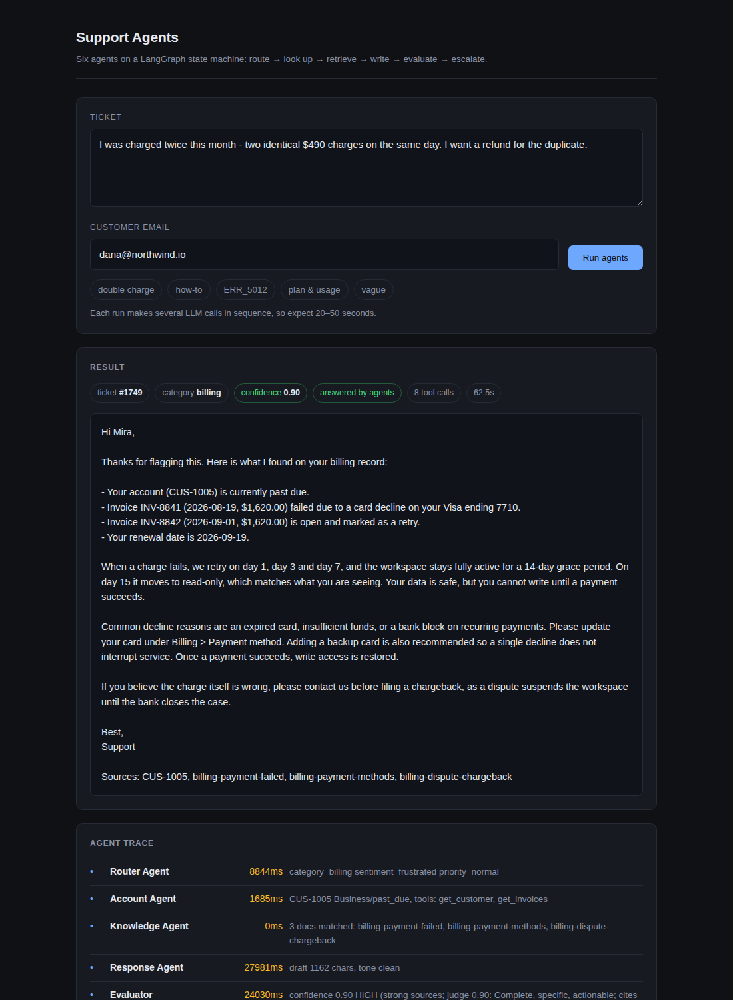

# support-agents

A customer support system built as a **LangGraph multi-agent state machine**. A ticket comes in,
a router agent classifies it, specialist agents work it with their own tools, an evaluator gates
the answer, and anything low-confidence or high-risk lands in a human queue.



## Why it looks like this

It started as an FAQ retrieval bot: one retriever, one answer step. Real tickets are not one
shape. Some need account data ("was I charged twice?"), some need troubleshooting steps
("ERR_5012 on upload"), some need a human ("I want a refund"). A single chain cannot branch and
cannot loop, so it was re-architected as a graph: specialist agents behind a router, and a real
escalation edge off an evaluator node.

## The graph

```
                          ┌──────────────────────┐
ingest ──> Router Agent ──┤ technical            ├──> Troubleshoot Agent ──┐
                          │ billing|account|refund                         │
                          │   + needs_account_data ──> Account Agent ──────┤
                          │ everything else                                │
                          └────────────────────────────────────────────────┴──> Knowledge Agent
                                                                                      │
                                                                                      v
                                                                             Response Agent
                                                                                      │
                                                                                      v
                                                                                 Evaluator
                                                                              ╱             ╲
                                                              confidence >= 0.60         low / refund
                                                              and no risk flags          / angry / legal
                                                                        ╱                     ╲
                                                                   respond  <──  Escalation Agent
```

Both specialists chain into the Knowledge Agent, so the writer always has help-doc citations on
top of whatever records were pulled. `technical` therefore runs **two** specialists in sequence -
that is the multi-agent cooperation path in the demo.

## The six agents

| Agent | Job | Tools | Failure mode |
|---|---|---|---|
| **Router** | classify `billing / technical / account / refund / unclear`, decide whether this customer's records are needed | `detect_sentiment`, `check_priority_keywords` | keyword routing table |
| **Knowledge** | BM25 retrieval over 40 help docs in `corpus/` | `search_docs`, `filter_by_category` | LLM query rewrite only fires on weak retrieval; falls back to long-word extraction |
| **Account** | pull plan, invoices, usage from `data/*.csv`; flag duplicate charges | `get_customer`, `get_invoices`, `usage_summary` | calls every lookup instead of choosing |
| **Troubleshoot** | match the error code and open incidents, order the fix steps | `lookup_error`, `known_issues` | prints the documented steps verbatim |
| **Response** | write the customer-facing reply from state only, cite sources | `get_template`, `check_tone` | fills the category template with retrieved facts |
| **Escalation** | write the human handoff, set priority, queue it | `create_handoff`, `notify_team` | assembles the handoff from state fields |
| *Evaluator* (control node) | score sources / coverage / specificity / tone, blended with an LLM judge | - | deterministic score only |

Every agent degrades to a deterministic fallback and prints a `[warn]` line to stderr. With the
API key removed the whole graph still runs end to end in **under half a second** and still
produces a grounded, cited answer.

## Run it

```bash
./run.sh setup                                  # venv + deps (python3.11)
./run.sh demo                                   # five tickets, five paths, trace trees
./run.sh serve                                  # API + UI on http://localhost:8000
./run.sh ask "Getting ERR_5012 on upload" --email sam@arcadia.co
```

`.env` needs `OPENROUTER_API_KEY`. Model is `z-ai/glm-5.3-flash` via OpenRouter, loaded through
one shared `get_llm()` in `llm.py` (temperature 0 for router/evaluator, 0.3 for the response).

### API

| Endpoint | What |
|---|---|
| `POST /ticket` | `{"text": "...", "email": "a@b.com"}` → answer, confidence, escalated, agents_used, tool_calls, trace |
| `GET /ticket/{id}` | stored result and full trace (falls back to `traces/<id>.json`) |
| `GET /queue` | the human escalation queue |
| `GET /health` | status, docs indexed, queue depth |
| `GET /` | the single-page UI |

```bash
curl -s -X POST localhost:8000/ticket -H 'Content-Type: application/json' \
  -d '{"text":"I was charged twice this month, I want a refund","email":"dana@northwind.io"}'
curl -s localhost:8000/queue
```

### How tickets get in for real

`POST /ticket` is the only seam. In production you point one of two things at it:

- a **Zendesk / Freshdesk webhook** on ticket-created, mapping `description` → `text` and
  `requester.email` → `email`;
- or an **IMAP poller** on the support inbox that turns each new message into the same payload.

Neither is built here on purpose. The graph does not know or care where the payload came from.

## Observability

Every agent appends `{agent, latency_ms, input_summary, output_summary}` to `state["trace"]`.
After a run the CLI prints it as a tree and the full record is written to
`traces/<ticket_id>.json`:

```
Ticket #5181  "I was charged twice this month - two identical $490 charges..."
├── Router Agent          4253ms  category=refund sentiment=neutral priority=high
├── Account Agent         5781ms  CUS-1001 Pro/active, tools: get_customer, get_invoices | DUPLICATE...
├── Knowledge Agent          0ms  3 docs matched: billing-duplicate-charge, refund-duplicate-charge...
├── Response Agent       56901ms  draft 859 chars, tone clean
├── Evaluator             1354ms  confidence 0.86 HIGH (strong sources; judge 0.80: Accurate, cites...)
└── Escalation Agent     16363ms  priority=high -> human queue (sla 4h)
   ESCALATED  confidence 0.86  total 84652ms
```

That tree answers the three questions you actually get asked about an agent system: which path
did it take, what did each step cost, and what did it base the answer on.

## Design decisions

**Why a graph, not a chain.** A chain is a fixed sequence. This workload needs two things a
chain cannot express: conditional branching (technical tickets need error lookup, billing
tickets need invoice lookup) and a loop back to a different terminal (escalation). LangGraph
gives typed shared state plus conditional edges, so routing is a declared edge you can read off
`graph.py` rather than a pile of `if` statements buried in one function.

**Why six agents, not one big prompt.** Each agent has one job, one prompt, one tool set and one
failure mode. That means each can be tested, degraded and swapped independently - the Account
Agent can lose the LLM and still return real invoice rows. One mega-prompt with every tool
attached would be cheaper to write and impossible to debug: you would not know whether a bad
answer came from misrouting, bad retrieval, or bad writing. The trace tells you exactly which.

**Why escalation is an edge, not an `if`.** `route_after_eval` in `agents/evaluator.py` is a
conditional edge in the compiled graph. The escalation policy is therefore one readable function
that a support lead could review, not logic hidden inside the response node. It fires on low
confidence, refund requests, angry sentiment, or legal keywords - a refund is escalated even
when the answer is confident, because a refund is a human decision.

**Why confidence is not just an LLM score.** An LLM asked to grade its own output is generous.
The score is 60% deterministic (were there sources, does the draft cover the ticket's terms, was
the ticket specific enough to answer, did the tone check pass) and 40% LLM judge. The vague
ticket in the demo scores 0.43 and escalates even though the draft reads perfectly well.

**Why BM25 and not embeddings.** 40 short help docs, keyword-heavy queries with error codes and
product nouns. BM25 with a crude stemmer retrieves them correctly, has no index to build, no
API to call and no drift. The retrieval step costs under a millisecond - visible in the trace.
Embeddings become worth it when the corpus is large enough that vocabulary mismatch actually
hurts.

## Layout

```
graph.py          nodes, edges, run_ticket()
state.py          the typed dict every node reads and writes
llm.py            the one shared get_llm() / call_llm()
trace.py          span(), the rich tree, trace JSON
agents/           router, knowledge, account, troubleshoot, response, escalation, evaluator
tools/            sentiment, docs (BM25), accounts, diagnostics, writing, handoff
corpus/           40 markdown help docs
data/             customers.csv, invoices.csv, error_codes.json, incidents.json, human_queue.json
api.py            FastAPI: /ticket, /queue, /health, /
static/index.html the UI, one file, no build step
demo.py, cli.py   the two entry points
```

## Known limits

- One LLM call per agent, in sequence, on a reasoning model: a live ticket takes **25-60
  seconds**. The per-agent breakdown is in every trace. `demo.py` runs the five tickets
  concurrently so the whole demo is ~90 seconds.
- Results are cached in-process; `traces/*.json` is the durable copy. There is no database.
- `data/human_queue.json` is a file, not a queue service. `notify_team` logs instead of paging.
