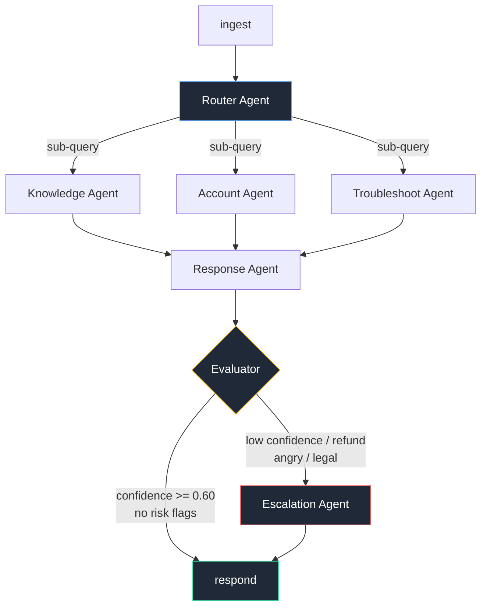

# Multi-Agent Customer Support

A support system built as a LangGraph state machine. A ticket comes in, a router agent splits
it into problems and dispatches a sub-query to every agent needed, each agent solves its piece
with its own tools, and an evaluator decides whether the reply goes out or a human takes over.


## The graph



The router fans out, it does not pick one path. A mail saying *"I was charged twice and my
uploads fail with ERR_5012"* dispatches two sub-queries:

```python
[{"agent": "account",      "query": "check for duplicate charges", "details": {"email": "..."}},
 {"agent": "troubleshoot", "query": "upload fails with ERR_5012",  "details": {"error_code": "ERR_5012"}}]
```

Both agents run in the same LangGraph superstep and append to `state["results"]`, an append-only
channel, so parallel writes merge instead of clobbering. Agents that were not dispatched never
run. The Response Agent merges every result into one reply that answers every problem.

## The agents

| Agent | Job | Tools |
|---|---|---|
| **Router** | split the mail, dispatch sub-queries, classify the ticket | `detect_sentiment`, `check_priority_keywords` |
| **Knowledge** | BM25 retrieval over 40 help docs | `search_docs`, `filter_by_category` |
| **Account** | plan, invoices, usage; flags duplicate charges | `get_customer`, `get_invoices`, `usage_summary` |
| **Troubleshoot** | match error codes and open incidents, order fix steps | `lookup_error`, `known_issues` |
| **Response** | merge results into one cited reply | `get_template`, `check_tone` |
| **Escalation** | write the human handoff, set priority, queue it | `create_handoff`, `notify_team` |
| **Evaluator** | score the draft, decide respond vs escalate | `score_sources`, `judge_answer` |

Every agent has a deterministic fallback. With the API key removed the whole graph still
completes in under half a second with a grounded, cited answer.

## What the Evaluator does

An LLM writing a confident-sounding reply is not the same as a correct reply, so the evaluator
sits between the draft and the customer.

It scores four things: did the agents return real sources, does the reply cover every problem
the router found, is it specific rather than filler, is the tone clean. That deterministic score
is 60%; an LLM judge comparing the draft to the original mail is the other 40%. The output is a
`confidence` number plus risk flags (refund, legal, cancellation, anger).

Those decide the conditional edge. A reply can be well written and still escalate: the
double-charge ticket scores 0.90 and still goes to a human, because refunds carry a risk flag.
Quality and safe-to-auto-send are different questions.

## Run it

```bash
python3.11 -m venv venv
venv/bin/pip install langgraph langchain-openai langchain-core python-dotenv rich \
  rank-bm25 pydantic fastapi uvicorn httpx

echo "OPENROUTER_API_KEY=sk-or-..." > .env
venv/bin/python server.py          # http://localhost:8000
```

```bash
curl -s localhost:8000/health

curl -s -X POST localhost:8000/ticket -H "Content-Type: application/json" \
  -d '{"text":"I was charged twice this month and my uploads keep failing with ERR_5012","email":"dana@northwind.io"}'

curl -s localhost:8000/queue
```

The server logs the full agent trace for every ticket:

```
Ticket #6102  "I was charged twice this month and my uploads keep failing..."
├── Router Agent          4701ms  dispatched: account, troubleshoot | category=refund
├── Account Agent          822ms  tools: get_customer, get_invoices | duplicate INV-8804/INV-8805
├── Troubleshoot Agent    4595ms  tools: lookup_error, known_issues | ERR_5012 + INC-2291
├── Response Agent        6465ms  merged 2 agent results, draft 1189 chars
├── Evaluator             1382ms  confidence 0.90 HIGH
└── Escalation Agent      7939ms  priority=high -> human queue (sla 4h)
   ESCALATED  confidence 0.90  total 25904ms
```

Each trace is also written to `traces/<ticket_id>.json`.

## API

| Endpoint | Purpose |
|---|---|
| `GET /` | single-page UI |
| `GET /health` | liveness |
| `POST /ticket` | `{text, email}` -> answer, confidence, dispatches, agents used, trace |
| `GET /ticket/{id}` | stored result and trace |
| `GET /queue` | human escalation queue |

In production a Zendesk/Freshdesk webhook or an IMAP poller on the support inbox posts to
`POST /ticket`. That endpoint is the only integration seam.

## Design decisions

**Graph, not a chain.** A chain cannot branch to a variable set of agents and cannot route to a
different terminal based on a later node's output. The router's fan-out and the evaluator's
escalation edge both need a graph.

**Separate agents, not one prompt.** Each agent has its own tools, its own prompt and its own
failure mode. When something is wrong the trace says which agent, not "the LLM was wrong".

**Tools next to their agent.** `agents/<name>/agent.py` is the node, `agents/<name>/tools.py`
is what it can do. Adding an agent is a new folder plus one dispatch entry.

**Traces first.** Every agent records a span. Without it, debugging a multi-agent run is
guesswork across scattered logs.

## Layout

```
server.py           entry point
api.py              FastAPI routes
graph.py            LangGraph wiring, fan-out, conditional edge
state.py            typed state
llm.py              OpenRouter client (glm-5.3-flash) + fallback
trace.py            spans, trace tree, JSON output
agents/<name>/      agent.py + tools.py
corpus/             40 help docs
data/               customers, invoices, error codes, incidents, human queue
static/index.html   UI
```
