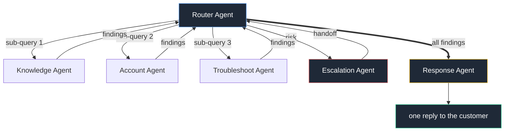

# Multi-Agent Customer Support

A support system built as a LangGraph state machine. A mail comes in, the router agent splits it
into separate problems and sends a sub-query to the agent that can solve each one. Every agent
works its own piece with its own tools and reports back to the router. The router hands the
collected findings to the response agent, which writes one reply.


## The graph



The router does not pick one path, it fans out. A mail saying *"I was charged twice and my
uploads fail with ERR_5012"* is two problems, so it produces two sub-queries:

```python
[{"agent": "account",      "query": "check for duplicate charges", "details": {"email": "..."}},
 {"agent": "troubleshoot", "query": "upload fails with ERR_5012",  "details": {"error_code": "ERR_5012"}}]
```

The account agent never sees the upload problem, the troubleshoot agent never sees the billing
one. Each gets only its own question and the details it needs.

Both run in the same LangGraph superstep and report their findings back to the router, appending
to `state["results"]` - an append-only channel, so parallel writes merge instead of clobbering
each other. Agents that were not dispatched never run.

The router collects everything the agents found and hands the whole set to the response agent,
which writes a single reply answering every problem, citing the record ids and doc ids the agents
actually returned.

## The agents

| Agent | Job | Tools |
|---|---|---|
| **Router** | split the mail, dispatch sub-queries, classify the ticket | `detect_sentiment`, `check_priority_keywords` |
| **Knowledge** | BM25 retrieval over 55 help docs | `search_docs`, `filter_by_category` |
| **Account** | plan, invoices, usage; flags duplicate charges | `get_customer`, `get_invoices`, `usage_summary` |
| **Troubleshoot** | match error codes and open incidents, order fix steps | `lookup_error`, `known_issues` |
| **Response** | merge results into one cited reply | `get_template`, `check_tone` |
| **Escalation** | write the human handoff, set priority, queue it | `create_handoff`, `notify_team` |

Every agent has a deterministic fallback. With the API key removed the whole graph still
completes in under half a second with a grounded, cited answer.

## When a human takes over

Escalation is not a stage after the answer - it is one of the agents the router can dispatch,
and it is dispatched only when a human genuinely has to decide:

- an explicit refund or cancellation request (money leaves the company)
- a legal threat - lawyer, GDPR, compliance, data breach
- a genuinely angry customer

Reporting a duplicate charge is deliberately *not* on that list. The account agent can confirm
it from the invoices and explain it, so that ticket gets answered automatically. Only when the
customer asks for the money back does escalation run.

The Escalation Agent writes the note a human reads first (what the customer wants, why it needs
a human, what to decide), queues it with a priority and an SLA, and pages the on-call channel.
Its result goes into `state["results"]` like any other agent, so the reply tells the customer
the facts *and* that a specialist is picking it up.

## Reading the logs

Every decision prints as it happens, so the terminal explains the run without a debugger:

```
router        tool check_priority_keywords -> high (matched ['refund'])
router        asking the LLM to split the mail into problems
router        risk check: refund request -> adding escalation
router        -> account: "Confirm duplicate charge on this customer's invoices" details={'email': ...}
router        -> troubleshoot: "Diagnose repeated upload failures" details={'error_code': 'ERR_5012'}
router        dispatching 3 agents in parallel
account       tool get_customer(dana@northwind.io) -> CUS-1001 on Pro
troubleshoot  tool lookup_error(ERR_5012) -> Upload rejected by storage
troubleshoot  tool known_issues(ERR_5012) -> INC-2291
escalation    needed because refunds are decided by a human -> priority high
router        all 3 agents reported back
router        <- Account Agent: duplicate INV-8804/INV-8805 (sources: CUS-1001, INV-8804, INV-8805)
router        <- Troubleshoot Agent: ERR_5012 + INC-2291 (sources: ERR_5012, INC-2291)
router        handing every finding to the response agent
response      received 3 findings from the router
response      writing one reply covering 3 problems
response      tool check_tone -> clean, draft 1336 chars
```

After that a trace tree prints the same run with per-agent latency, and the full JSON is saved
to `traces/<ticket_id>.json`.

## Run it

```bash
python3.11 -m venv venv
venv/bin/pip install langgraph langchain-openai langchain-core python-dotenv rich \
  rank-bm25 pydantic fastapi uvicorn httpx

echo "OPENROUTER_API_KEY=sk-or-..." > .env
venv/bin/python server.py          # http://localhost:8000
```

```bash
curl -s localhost:8000/health

curl -s -X POST localhost:8000/ticket -H "Content-Type: application/json" \
  -d '{"text":"I was charged twice this month and my uploads keep failing with ERR_5012","email":"dana@northwind.io"}'

curl -s localhost:8000/queue
```

The server logs the full agent trace for every ticket:

```
Ticket #6102  "I was charged twice this month and my uploads keep failing..."
├── Router Agent          4701ms  dispatched: account, troubleshoot | category=refund
├── Account Agent          822ms  tools: get_customer, get_invoices | duplicate INV-8804/INV-8805
├── Troubleshoot Agent    4595ms  tools: lookup_error, known_issues | ERR_5012 + INC-2291
├── Response Agent        6465ms  merged 2 agent results, draft 1189 chars
└── Escalation Agent      7939ms  priority=high -> human queue (sla 4h)
   ESCALATED  total 25904ms
```

Each trace is also written to `traces/<ticket_id>.json`.

## API

| Endpoint | Purpose |
|---|---|
| `GET /` | single-page UI |
| `GET /health` | liveness |
| `POST /ticket` | `{text, email}` -> answer, category, dispatches, agents used, trace |
| `GET /ticket/{id}` | stored result and trace |
| `GET /queue` | human escalation queue |

In production a Zendesk/Freshdesk webhook or an IMAP poller on the support inbox posts to
`POST /ticket`. That endpoint is the only integration seam.

## Design decisions

**Graph, not a chain.** A chain cannot branch to a variable set of agents and cannot route to a
different terminal based on a later node's output. The router's fan-out and the escalation
edge both need a graph.

**Separate agents, not one prompt.** Each agent has its own tools, its own prompt and its own
failure mode. When something is wrong the trace says which agent, not "the LLM was wrong".

**Tools next to their agent.** `agents/<name>/agent.py` is the node, `agents/<name>/tools.py`
is what it can do. Adding an agent is a new folder plus one dispatch entry.

**Traces first.** Every agent records a span. Without it, debugging a multi-agent run is
guesswork across scattered logs.

## Layout

```
server.py           entry point
api.py              FastAPI routes
graph.py            LangGraph wiring, fan-out, conditional edge
state.py            typed state
llm.py              OpenRouter client (glm-5.3-flash) + fallback
trace.py            spans, trace tree, JSON output
agents/<name>/      agent.py + tools.py
corpus/             55 help docs
data/               customers, invoices, error codes, incidents, human queue
static/index.html   UI
```
