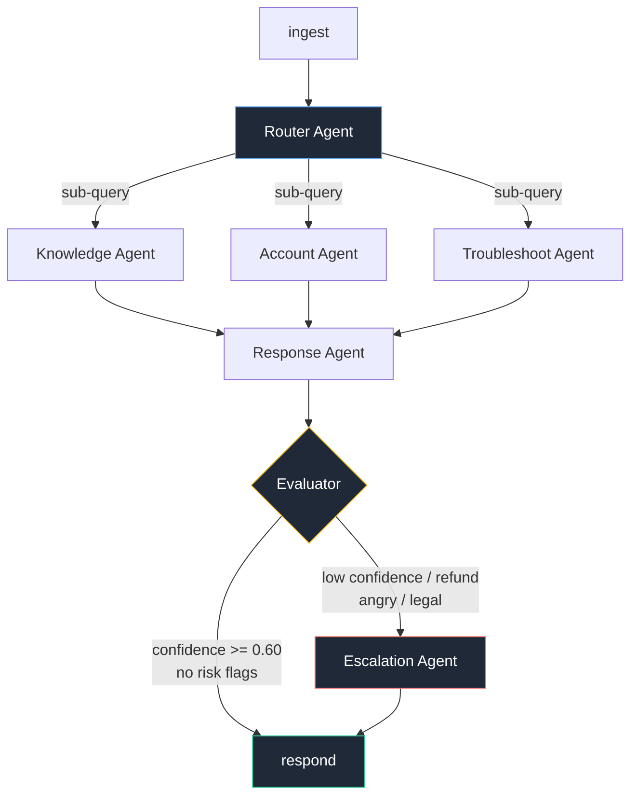

# support-agents

A customer support system built as a **LangGraph multi-agent state machine**. A mail comes in, a
router agent splits it into problems and dispatches each one to the specialist that can solve it,
those agents run in parallel with their own tools, a response agent merges their answers, an
evaluator gates the result, and anything low-confidence or high-risk lands in a human queue.


## Why it looks like this

It started as an FAQ retrieval bot: one retriever, one answer step. Real support mail is not one
shape, and it is usually not one problem either: *"I was charged twice AND my uploads keep
failing with ERR_5012"* is one mail with two unrelated jobs in it. A single chain cannot split
that, cannot branch and cannot loop, so it was re-architected as a graph: a router that fans out
to every agent the mail needs, and a real escalation edge off an evaluator node.

## The graph



**The dispatch model.** The Router Agent splits the mail into separate problems and writes one
*transformed sub-query* per problem, addressed to the agent that can solve it, with the details
that agent needs (`{"agent": "troubleshoot", "query": "upload fails with ERR_5012", "details":
{"error_code": "ERR_5012"}}`). Every dispatched agent then runs on its own piece with its own
tools - one, two or all three of them, concurrently in a single LangGraph superstep; agents that
were not dispatched never run. The Response Agent merges every result into one reply that
answers every problem, and the Evaluator scores that merged draft.

Each specialist appends its result to `state["results"]`, an append-only channel, so parallel
writes merge instead of clobbering each other.

## The six agents

| Agent | Job | Tools | Failure mode |
|---|---|---|---|
| **Router** | split the mail into problems, dispatch a sub-query to each agent needed, classify `billing / technical / account / refund / unclear` | `detect_sentiment`, `check_priority_keywords` | keyword dispatch table |
| **Knowledge** | BM25 retrieval over 40 help docs in `corpus/` | `search_docs`, `filter_by_category` | LLM query rewrite only fires on weak retrieval; falls back to long-word extraction |
| **Account** | pull plan, invoices, usage from `data/*.csv`; flag duplicate charges | `get_customer`, `get_invoices`, `usage_summary` | calls every lookup instead of choosing |
| **Troubleshoot** | match the error code and open incidents, order the fix steps | `lookup_error`, `known_issues` | prints the documented steps verbatim |
| **Response** | merge every agent result into one reply that answers every problem, cite sources | `get_template`, `check_tone` | fills the category template with one block per result |
| **Escalation** | write the human handoff, set priority, queue it | `create_handoff`, `notify_team` | assembles the handoff from the merged results |
| *Evaluator* (control node) | score sources / coverage / specificity / tone, blended with an LLM judge | `score_sources`, `judge_answer` | deterministic score only |

Every agent degrades to a deterministic fallback and prints a `[warn]` line to stderr. With the
API key removed the whole graph still runs end to end in **under half a second** and still
produces a grounded, cited answer.

## What the Evaluator does

An LLM writing a confident-sounding reply is not the same as a correct reply. The Evaluator is
the gate between the draft and the customer.

It scores the merged draft on four things: did the agents actually return sources (records or
docs), does the reply cover every problem the router split out, is it specific rather than
generic filler, and is the tone clean. That deterministic score is 60% of the result; an LLM
judge scoring the draft against the original mail is the other 40%.

The output is one number, `confidence`, and a set of risk flags (refund, legal, cancellation,
angry sentiment). Those two decide the conditional edge: `confidence >= 0.60` and no risk flags
means the reply goes out, anything else goes to the Escalation Agent. That is the whole point of
the graph shape - the decision to hand off is a separate node with its own reasoning, not an
`if` buried inside the response step.

So a reply can be well written and still escalate: the double-charge ticket scores 0.90 and is
*still* routed to a human, because refunds carry a risk flag. High quality is not the same as
safe to auto-send.

## Run it

```bash
./run.sh setup                                  # venv + deps (python3.11)
./run.sh demo                                   # five mails, five fan-outs, trace trees
venv/bin/python server.py                       # API + UI on http://localhost:8000
./run.sh ask "Getting ERR_5012 on upload" --email sam@arcadia.co
```

`.env` needs `OPENROUTER_API_KEY`. Model is `z-ai/glm-5.3-flash` via OpenRouter, loaded through
one shared `get_llm()` in `llm.py` (temperature 0 for router/evaluator, 0.3 for the response).

### API

| Endpoint | What |
|---|---|
| `POST /ticket` | `{"text": "...", "email": "a@b.com"}` → answer, confidence, escalated, agents_used, tool_calls, trace |
| `GET /ticket/{id}` | stored result and full trace (falls back to `traces/<id>.json`) |
| `GET /queue` | the human escalation queue |
| `GET /health` | status, docs indexed, queue depth |
| `GET /` | the single-page UI |

```bash
curl -s -X POST localhost:8000/ticket -H 'Content-Type: application/json' \
  -d '{"text":"I was charged twice this month, I want a refund","email":"dana@northwind.io"}'
curl -s localhost:8000/queue
```

### How tickets get in for real

`POST /ticket` is the only seam. In production you point one of two things at it:

- a **Zendesk / Freshdesk webhook** on ticket-created, mapping `description` → `text` and
  `requester.email` → `email`;
- or an **IMAP poller** on the support inbox that turns each new message into the same payload.

Neither is built here on purpose. The graph does not know or care where the payload came from.

## Observability

Every agent appends `{agent, latency_ms, input_summary, output_summary}` to `state["trace"]`.
After a run the CLI prints it as a tree and the full record is written to
`traces/<ticket_id>.json`:

```
Ticket #3517  "Two problems in one mail. My last invoice shows two identical $490 ..."
├── Router Agent          2822ms  dispatched: account, troubleshoot | category=billing sentiment=ne...
├── Account Agent        17227ms  tools: get_customer, get_invoices | duplicate INV-8804/INV-8805
├── Troubleshoot Agent   33018ms  tools: lookup_error, known_issues | ERR_5012 + INC-2291
├── Response Agent       14426ms  merged 2 agent results (account, troubleshoot), draft 1170 chars...
└── Evaluator             1566ms  confidence 0.80 HIGH (strong sources; judge 0.70: Both issues add...
   ANSWERED  confidence 0.80  total 69059ms
```

Two agents, two problems, one reply - and the wall clock for that ticket was 51.8s against 69.0s
of summed agent time, which is the fan-out running concurrently. The tree answers the three
questions you actually get asked about an agent system: which agents were dispatched and why,
what did each cost, and what did it base the answer on.

## Design decisions

**Why a graph, not a chain.** A chain is a fixed sequence. This workload needs three things a
chain cannot express: a **fan-out** (one mail, two or three problems, each solved by a different
agent), a fan-in that merges those answers, and a loop back to a different terminal
(escalation). LangGraph gives typed shared state plus conditional edges, so the fan-out is a
declared edge you can read off `graph.py` rather than a pile of `if` statements buried in one
function.

**Why the router transforms the query.** Handing every agent the raw mail makes each of them
re-read the whole thing and guess which part is theirs. The router does that split once, so the
Troubleshoot Agent gets "upload fails with ERR_5012" and the Account Agent gets "check the last
invoice for duplicate charges" - narrower prompts, better tool choices, and a trace that shows
exactly what each agent was asked.

**Why six agents, not one big prompt.** Each agent has one job, one prompt, one tool set, one
folder and one failure mode. That means each can be tested, degraded and swapped independently -
the Account Agent can lose the LLM and still return real invoice rows. One mega-prompt with every
tool attached would be cheaper to write and impossible to debug: you would not know whether a bad
answer came from a missed dispatch, bad retrieval, or bad writing. The trace tells you which.

**Why escalation is an edge, not an `if`.** `route_after_eval` in `agents/evaluator/agent.py` is a
conditional edge in the compiled graph. The escalation policy is therefore one readable function
that a support lead could review, not logic hidden inside the response node. It fires on low
confidence, refund requests, angry sentiment, or legal keywords - a refund is escalated even
when the answer is confident, because a refund is a human decision.

**Why confidence is not just an LLM score.** An LLM asked to grade its own output is generous.
The score is 60% deterministic (were there sources, does the draft cover the ticket's terms, was
the ticket specific enough to answer, did the tone check pass) and 40% LLM judge. The vague
ticket in the demo scores 0.43 and escalates even though the draft reads perfectly well.

**Why BM25 and not embeddings.** 40 short help docs, keyword-heavy queries with error codes and
product nouns. BM25 with a crude stemmer retrieves them correctly, has no index to build, no
API to call and no drift. The retrieval step costs under a millisecond - visible in the trace.
Embeddings become worth it when the corpus is large enough that vocabulary mismatch actually
hurts.

## Layout

```
graph.py          nodes, the fan-out edge, run_ticket()
state.py          the typed dict every node reads and writes
llm.py            the one shared get_llm() / call_llm()
trace.py          span(), record(), the rich tree, trace JSON
agents/           one folder per agent, each with agent.py (node + prompt) and tools.py
  router/         detect_sentiment, check_priority_keywords
  knowledge/      search_docs, filter_by_category
  account/        get_customer, get_invoices, usage_summary
  troubleshoot/   lookup_error, known_issues
  response/       get_template, check_tone
  escalation/     create_handoff, notify_team
  evaluator/      score_sources, judge_answer
corpus/           40 markdown help docs
data/             customers.csv, invoices.csv, error_codes.json, incidents.json, human_queue.json
api.py            FastAPI: /ticket, /queue, /health, /
static/index.html the UI, one file, no build step
demo.py, cli.py   the two entry points
```

## Known limits

- One LLM call per agent on a reasoning model whose reasoning cannot be disabled: a live ticket
  takes **25-90 seconds**, and it varies a lot with provider load. The fanned-out specialists run
  concurrently, so a two-agent mail costs the slower of the two, not the sum. The per-agent
  breakdown is in every trace. `demo.py` runs the five mails concurrently too.
- Results are cached in-process; `traces/*.json` is the durable copy. There is no database.
- `data/human_queue.json` is a file, not a queue service. `notify_team` logs instead of paging.
